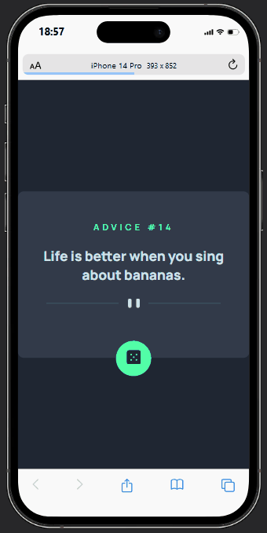

## PT-BR

# Aplicativo Gerador de Conselhos

## Descrição
O aplicativo Gerador de Conselhos é um aplicativo da web simples que busca conselhos aleatórios de uma API externa e os exibe ao usuário. O aplicativo apresenta um design limpo e responsivo, tornando-o acessível em dispositivos móveis e de mesa.

### Responsivo

## Tecnologias
- HTML
- CSS
- JavaScript
- Integração com API

## Recursos
- Busca conselhos aleatórios da [Advice Slip API](https://api.adviceslip.com/advice).
- Exibe o ID e a descrição do conselho.
- Design responsivo com diferentes layouts para dispositivos móveis e de mesa.
- Interface amigável com um botão para gerar novos conselhos.

## Uso
- Clique no botão do ícone de dado para gerar um novo conselho.
- O conselho será exibido junto com seu ID.

______________________________________________________________

 

## EN

# Advice Generator App

## Description
The Advice Generator app is a simple web application that fetches random advice from an external API and displays it to the user. The app features a clean and responsive design, making it accessible on both mobile and desktop devices.

### Responsive

## Technologies
- HTML
- CSS
- JavaScript
- API Integration

## Features
- Fetches random advice from the [Advice Slip API](https://api.adviceslip.com/advice).
- Displays the advice ID and description.
- Responsive design with different layouts for mobile and desktop devices. - User-friendly interface with a button to generate new advice.

## Usage
- Click the dice icon button to generate a new advice.
- The advice will be displayed along with its ID.